<link href="style.css" rel="stylesheet">

# Overview
Our method allows to learn continuous high-level controls from simple annotations in symbolic music generation.
In this page, we show additional experimental results for 13 attributes, audio samples and feature 
explanations from the official [webpage](http://jmir.sourceforge.net/manuals/jSymbolic_manual/home.html). 

- [Single attribute](#single-attribute)
- [Double attributes](#double-attributes)
- [Triple attribute](#triple-attributes)

# Single attribute
## Total number of notes
Total number of notes, including both pitched and unpitched notes.

||→Increase total number of notes→||
|:-:|:-:|:-:|
|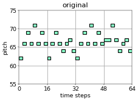 <audio controls><source src="mp3/single_attribute/Total_Number_of_Notes/ours/reels_simple_chords_418.mid_2_0.mp3"></audio>|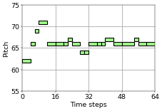 <audio controls><source src="mp3/single_attribute/Total_Number_of_Notes/ours/reels_simple_chords_418.mid_2_0_Total_Number_of_Notes_-0.17558.mp3"></audio>|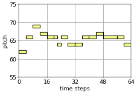 <audio controls><source src="mp3/single_attribute/Total_Number_of_Notes/ours/reels_simple_chords_418.mid_2_0_Total_Number_of_Notes_-0.67558.mp3"></audio>|

## Pitch variability
Standard deviation of the MIDI pitches of all pitched notes in the piece. Provides a measure of how close the pitches 
as a whole are to the mean pitch.

||→Increase pitch variability→||
|:-:|:-:|:-:|
| <audio controls><source src="mp3/single_attribute/Pitch_Variability/ours/reels_simple_chords_418.mid_2_0.mp3"></audio>|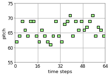 <audio controls><source src="mp3/single_attribute/Pitch_Variability/ours/reels_simple_chords_418.mid_2_0_Pitch_Variability_-0.17049.mp3"></audio>|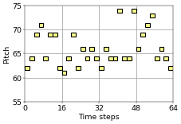 <audio controls><source src="mp3/single_attribute/Pitch_Variability/ours/reels_simple_chords_418.mid_2_0_Pitch_Variability_0.82951.mp3"></audio>|

## Rhythmic value variability
Standard deviation of the note durations in quarter notes of all notes in the music. Provides a measure of how close the 
rhythmic values are to the mean rhythmic value. This calculation includes both pitched and unpitched notes, is 
calculated after rhythmic quantization, is not influenced by tempo, and is calculated without regard to the dynamics, 
voice or instrument of any given note.

The model can increase the variety of the note durations according the the attribute control.

||→Increase rhythmic value variability→||
|:-:|:-:|:-:|
|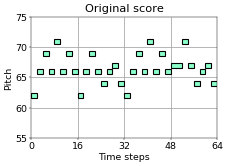 <audio controls><source src="mp3/single_attribute/Rhythmic_Value_Variability/ours/reels_simple_chords_418.mid_2_0.mp3"></audio>|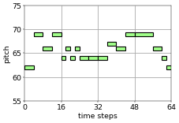 <audio controls><source src="mp3/single_attribute/Rhythmic_Value_Variability/ours/reels_simple_chords_418.mid_2_0_Rhythmic_Value_Variability_-0.26632.mp3"></audio>|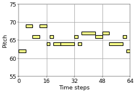 <audio controls><source src="mp3/single_attribute/Rhythmic_Value_Variability/ours/reels_simple_chords_418.mid_2_0_Rhythmic_Value_Variability_0.73368.mp3"></audio>|

## Pitch kurtosis
Kurtosis of the MIDI pitches of all pitched notes in the piece. Provides a measure of how peaked or flat the pitch 
distribution is. The higher the kurtosis, the more the pitches are clustered near the mean and the fewer outliers there 
are.

The results show that the model is able to decrease pitch kurtosis successfully in this example.

||→Decrease pitch kurtosis→||
|:-:|:-:|:-:|
| 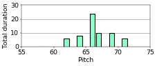 <audio controls><source src="mp3/single_attribute/Pitch_Kurtosis/ours/reels_simple_chords_418.mid_2_0.mp3"></audio>|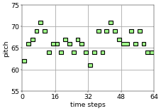 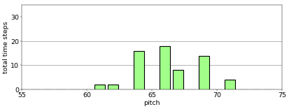 <audio controls><source src="mp3/single_attribute/Pitch_Kurtosis/ours/reels_simple_chords_418.mid_2_0_Pitch_Kurtosis_-0.7998.mp3"></audio>|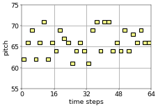 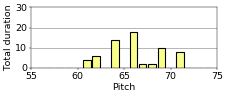 <audio controls><source src="mp3/single_attribute/Pitch_Kurtosis/ours/reels_simple_chords_418.mid_2_0_Pitch_Kurtosis_-2.2998.mp3"></audio>|

##  Pitch skewness
Skewness of the MIDI pitches of all pitched notes in the piece. Provides a measure of how asymmetrical the pitch 
distribution is to either the left or the right of the mean pitch. A value of zero indicates no skew.

As we showed the results in the paper, this attribute is relatively difficult to train.
In this example, the pitch skewness of the results decreases although we add the attribute to increase it.

||→Increase pitch skewness→||
|:-:|:-:|:-:|
|  <audio controls><source src="mp3/single_attribute/Pitch_Skewness/ours/reels_simple_chords_418.mid_2_0.mp3"></audio>| 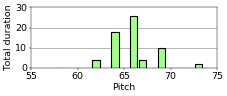 <audio controls><source src="mp3/single_attribute/Pitch_Skewness/ours/reels_simple_chords_418.mid_2_0_Pitch_Skewness_1.8853.mp3"></audio>|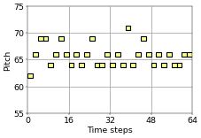 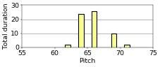 <audio controls><source src="mp3/single_attribute/Pitch_Skewness/ours/reels_simple_chords_418.mid_2_0_Pitch_Skewness_2.8853.mp3"></audio>|

## Prevalence of most common rhythmic value
The fraction of all notes that have a rhythmic value corresponding to the most common rhythmic value in the music. 
This calculation includes both pitched and unpitched notes, is calculated after rhythmic quantization, is not influenced 
by tempo, and is calculated without regard to the dynamics, voice or instrument of any given note.

The most common rhythmic value is 8th note. The notes that are NOT 8th notes are shown in red.
The model is able to decrease the prevalence of 8th notes according to the control.

||→Decrease the prevalence of 8th notes→||
|:-:|:-:|:-:|
|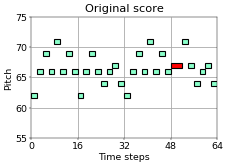 <audio controls><source src="mp3/single_attribute/Prevalence_of_Most_Common_Rhythmic_Value/ours/reels_simple_chords_418.mid_2_0.mp3"></audio>|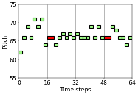 <audio controls><source src="mp3/single_attribute/Prevalence_of_Most_Common_Rhythmic_Value/ours/reels_simple_chords_418.mid_2_0_Prevalence_of_Most_Common_Rhythmic_Value_0.78566.mp3"></audio>|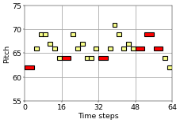 <audio controls><source src="mp3/single_attribute/Prevalence_of_Most_Common_Rhythmic_Value/ours/reels_simple_chords_418.mid_2_0_Prevalence_of_Most_Common_Rhythmic_Value_-0.21434.mp3"></audio>|

## Average note duration
Average duration of notes (in seconds).

||→Decrease average note duration→||
|:-:|:-:|:-:|
| <audio controls><source src="mp3/single_attribute/Average_Note_Duration/ours/reels_simple_chords_418.mid_2_0.mp3"></audio>|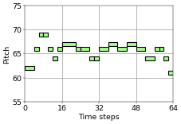 <audio controls><source src="mp3/single_attribute/Average_Note_Duration/ours/reels_simple_chords_418.mid_2_0_Average_Note_Duration_-0.45437.mp3"></audio>|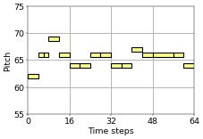 <audio controls><source src="mp3/single_attribute/Average_Note_Duration/ours/reels_simple_chords_418.mid_2_0_Average_Note_Duration_0.54563.mp3"></audio>|

## Note density variability
How much the note density (average number of notes per second) varies throughout the piece. Takes into account all notes 
in all voices, including both pitched and unpitched notes. In order to calculate this, the piece is broken into windows 
of 5 second duration, and the note density of each window is calculated. The final value of this feature is then found 
by calculating the standard deviation of the note densities of these windows. Set to 0 if there is insufficient music 
for more than one window.

||→Increase note density variability→||
|:-:|:-:|:-:|
| <audio controls><source src="mp3/single_attribute/Note_Density_Variability/ours/reels_simple_chords_418.mid_2_0.mp3"></audio>|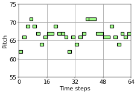 <audio controls><source src="mp3/single_attribute/Note_Density_Variability/ours/reels_simple_chords_418.mid_2_0_Note_Density_Variability_0.70796.mp3"></audio>|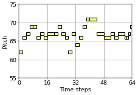 <audio controls><source src="mp3/single_attribute/Note_Density_Variability/ours/reels_simple_chords_418.mid_2_0_Note_Density_Variability_1.208.mp3"></audio>|

## Amount of arpeggiation
Fraction of melodic intervals that are repeated notes, minor thirds, major thirds, perfect fifths, minor sevenths, 
major sevenths, octaves, minor tenths or major tenths. This is only a very approximate measure of the amount of 
arpeggiation in the music, of course.

The successive notes whose interval corresponds to definition of `arpeggiation` are shown in red.
The results show that the model can control this attirbute appropriately.

||→Decrease amount of arpeggiation→||
|:-:|:-:|:-:|
|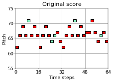 <audio controls><source src="mp3/single_attribute/Amount_of_Arpeggiation/ours/reels_simple_chords_418.mid_2_0.mp3"></audio>|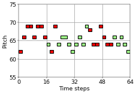 <audio controls><source src="mp3/single_attribute/Amount_of_Arpeggiation/ours/reels_simple_chords_418.mid_2_0_Amount_of_Arpeggiation_0.55144.mp3"></audio>|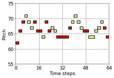 <audio controls><source src="mp3/single_attribute/Amount_of_Arpeggiation/ours/reels_simple_chords_418.mid_2_0_Amount_of_Arpeggiation_-0.44856.mp3"></audio>|

## Chromatic motion
Fraction of melodic intervals that correspond to a semitone.

Successive notes whose interval is semitone, which correpond to chromatic motion, are shown in red.

||→Increase chromatic motion→||
|:-:|:-:|:-:|
|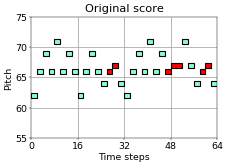 <audio controls><source src="mp3/single_attribute/Chromatic_Motion/ours/reels_simple_chords_418.mid_2_0.mp3"></audio>|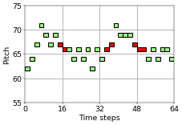 <audio controls><source src="mp3/single_attribute/Chromatic_Motion/ours/reels_simple_chords_418.mid_2_0_Chromatic_Motion_0.92178.mp3"></audio>|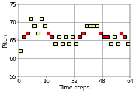 <audio controls><source src="mp3/single_attribute/Chromatic_Motion/ours/reels_simple_chords_418.mid_2_0_Chromatic_Motion_1.4218.mp3"></audio>|

## Direction of melodic motion
Fraction of melodic intervals that are rising in pitch. Set to zero if no rising or falling melodic intervals are found.

The rising-pitch intervals are shown in red and the others are in blue.
The results indicate that the model is successfully change the ratio of direction of melodic motion.

||→Decrease the rising-pitch intervals→||
|:-:|:-:|:-:|
|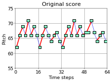 <audio controls><source src="mp3/single_attribute/Direction_of_Melodic_Motion/ours/reels_simple_chords_418.mid_2_0.mp3"></audi>?|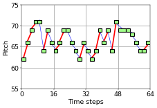 <audio controls><source src="mp3/single_attribute/Direction_of_Melodic_Motion/ours/reels_simple_chords_418.mid_2_0_Direction_of_Melodic_Motion_-0.90567.mp3"></audio>| <audio controls><source src="mp3/single_attribute/Direction_of_Melodic_Motion/ours/reels_simple_chords_418.mid_2_0_Direction_of_Melodic_Motion_-1.4057.mp3"></audio>|

## Average interval spanned by melodic arcs
Average melodic interval (in semitones) separating the top note of melodic peaks and the bottom note of adjacent melodic 
troughs. 

||→Increase melodic arcs interval span→||
|:-:|:-:|:-:|
| <audio controls><source src="mp3/single_attribute/Average_Interval_Spanned_by_Melodic_Arcs/ours/reels_simple_chords_418.mid_2_0.mp3"></audio>| <audio controls><source src="mp3/single_attribute/Average_Interval_Spanned_by_Melodic_Arcs/ours/reels_simple_chords_418.mid_2_0_Average_Interval_Spanned_by_Melodic_Arcs_1.0243.mp3"></audio>|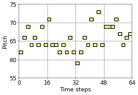 <audio controls><source src="mp3/single_attribute/Average_Interval_Spanned_by_Melodic_Arcs/ours/reels_simple_chords_418.mid_2_0_Average_Interval_Spanned_by_Melodic_Arcs_1.5243.mp3"></audio>|

## Chord duration
Average duration a chord in units of time corresponding to the duration of an idealized quarter note. A "chord" here is 
considered to stay the same as long as no new pitch classes are added, and no pitch classes are taken away. 
This "chord" may consist of any number of pitch classes, even only one. A "chord" is not considered to end if it is
split by one or more rests (although the rests themselves are not counted in the duration of the "chord").

Since we are using monophonic music in our work, chord duration is closely related to average note duration.

||→Increase chord duration→||
|:-:|:-:|:-:|
| <audio controls><source src="mp3/single_attribute/Chord_Duration/ours/reels_simple_chords_418.mid_2_0.mp3"></audio>|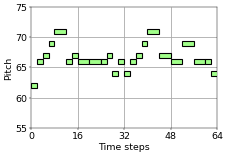 <audio controls><source src="mp3/single_attribute/Chord_Duration/ours/reels_simple_chords_418.mid_2_0_Chord_Duration_-0.45309.mp3"></audio>|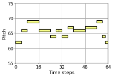 <audio controls><source src="mp3/single_attribute/Chord_Duration/ours/reels_simple_chords_418.mid_2_0_Chord_Duration_0.54691.mp3"></audio>|

# Double attributes
In this section, two attributes are trained at the same time. The original data is shown at the top-left in each setting.

## Total number of notes & pitch variability
The model can control the total number of notes and pitch variability at the same time.

|↓Reduce total number of notes↓|→Increase pitch variability→||
|:-:|:-:|:-:|
| <audio controls><source src="mp3/double_attributes/total_pitch/reels_simple_chords_418.mid_2_0.mp3"></audio>|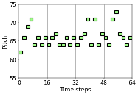 <audio controls><source src="mp3/double_attributes/total_pitch/reels_simple_chords_418.mid_2_0_demo_Total_Number_of_Notes_1.3244_Pitch_Variability_-0.17049.mp3"></audio>|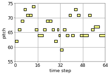 <audio controls><source src="mp3/double_attributes/total_pitch/reels_simple_chords_418.mid_2_0_demo_Total_Number_of_Notes_1.3244_Pitch_Variability_0.82951.mp3"></audio>|
|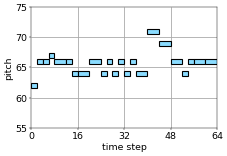 <audio controls><source src="mp3/double_attributes/total_pitch/reels_simple_chords_418.mid_2_0_demo_Total_Number_of_Notes_0.32442_Pitch_Variability_-1.1705.mp3"></audio>|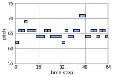 <audio controls><source src="mp3/double_attributes/total_pitch/reels_simple_chords_418.mid_2_0_demo_Total_Number_of_Notes_0.32442_Pitch_Variability_-0.17049.mp3"></audio>|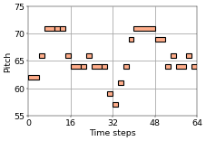 <audio controls><source src="mp3/double_attributes/total_pitch/reels_simple_chords_418.mid_2_0_demo_Total_Number_of_Notes_0.32442_Pitch_Variability_0.82951.mp3"></audio>|
|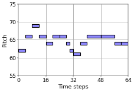 <audio controls><source src="mp3/double_attributes/total_pitch/reels_simple_chords_418.mid_2_0_demo_Total_Number_of_Notes_-0.67558_Pitch_Variability_-1.1705.mp3"></audio>|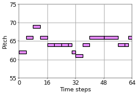 <audio controls><source src="mp3/double_attributes/total_pitch/reels_simple_chords_418.mid_2_0_demo_Total_Number_of_Notes_-0.67558_Pitch_Variability_-0.17049.mp3"></audio>|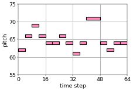 <audio controls><source src="mp3/double_attributes/total_pitch/reels_simple_chords_418.mid_2_0_demo_Total_Number_of_Notes_-0.67558_Pitch_Variability_0.82951.mp3"></audio>|

## Total number of notes & rhythmic value variability
When the model tries to increase rhythmic value variability while keeping the total number of notes, it adds longer and shorter notes at the same time to use larger variety of note lengths.

|↓Reduce total number of notes↓|→Increase rhythmic value variability→||
|:-:|:-:|:-:|
| <audio controls><source src="mp3/double_attributes/total_rhythm/reels_simple_chords_418.mid_2_0.mp3"></audio>|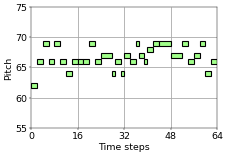 <audio controls><source src="mp3/double_attributes/total_rhythm/reels_simple_chords_418.mid_2_0_demo_Total_Number_of_Notes_1.3244_Rhythmic_Value_Variability_-0.76632.mp3"></audio>|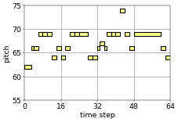 <audio controls><source src="mp3/double_attributes/total_rhythm/reels_simple_chords_418.mid_2_0_demo_Total_Number_of_Notes_1.3244_Rhythmic_Value_Variability_0.73368.mp3"></audio>|
|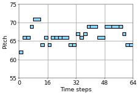 <audio controls><source src="mp3/double_attributes/total_rhythm/reels_simple_chords_418.mid_2_0_demo_Total_Number_of_Notes_0.32442_Rhythmic_Value_Variability_-1.2663.mp3"></audio>|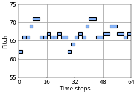 <audio controls><source src="mp3/double_attributes/total_rhythm/reels_simple_chords_418.mid_2_0_demo_Total_Number_of_Notes_0.32442_Rhythmic_Value_Variability_-0.76632.mp3"></audio>|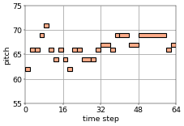 <audio controls><source src="mp3/double_attributes/total_rhythm/reels_simple_chords_418.mid_2_0_demo_Total_Number_of_Notes_0.32442_Rhythmic_Value_Variability_0.73368.mp3"></audio>|
|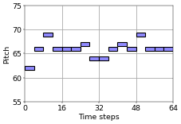 <audio controls><source src="mp3/double_attributes/total_rhythm/reels_simple_chords_418.mid_2_0_demo_Total_Number_of_Notes_-0.67558_Rhythmic_Value_Variability_-1.2663.mp3"></audio>|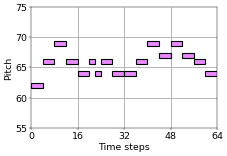 <audio controls><source src="mp3/double_attributes/total_rhythm/reels_simple_chords_418.mid_2_0_demo_Total_Number_of_Notes_-0.67558_Rhythmic_Value_Variability_-0.76632.mp3"></audio>|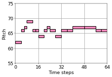 <audio controls><source src="mp3/double_attributes/total_rhythm/reels_simple_chords_418.mid_2_0_demo_Total_Number_of_Notes_-0.67558_Rhythmic_Value_Variability_0.73368.mp3"></audio>|

## Total number of notes & chromatic motion
Successive notes whose interval is semitone, which correpond to chromatic motion, are shown in red.
Compared to the total number of notes or pitch variability, chromatic motion is difficult to train, but the model can control this attribute mostly.

|↓Reduce total number of notes↓|→Increase chromatic motion→||
|:-:|:-:|:-:|
| <audio controls><source src="mp3/double_attributes/total_chrom/reels_simple_chords_418.mid_2_0.mp3"></audio>| <audio controls><source src="mp3/double_attributes/total_chrom/reels_simple_chords_418.mid_2_0_demo_Total_Number_of_Notes_1.3244_Chromatic_Motion_0.42178.mp3"></audio>| <audio controls><source src="mp3/double_attributes/total_chrom/reels_simple_chords_418.mid_2_0_demo_Total_Number_of_Notes_1.3244_Chromatic_Motion_1.4218.mp3"></audio>|
| <audio controls><source src="mp3/double_attributes/total_chrom/reels_simple_chords_418.mid_2_0_demo_Total_Number_of_Notes_0.32442_Chromatic_Motion_-0.57822.mp3"></audio>| <audio controls><source src="mp3/double_attributes/total_chrom/reels_simple_chords_418.mid_2_0_demo_Total_Number_of_Notes_0.32442_Chromatic_Motion_0.42178.mp3"></audio>| <audio controls><source src="mp3/double_attributes/total_chrom/reels_simple_chords_418.mid_2_0_demo_Total_Number_of_Notes_0.32442_Chromatic_Motion_1.4218.mp3"></audio>|
| <audio controls><source src="mp3/double_attributes/total_chrom/reels_simple_chords_418.mid_2_0_demo_Total_Number_of_Notes_-0.67558_Chromatic_Motion_-0.57822.mp3"></audio>| <audio controls><source src="mp3/double_attributes/total_chrom/reels_simple_chords_418.mid_2_0_demo_Total_Number_of_Notes_-0.67558_Chromatic_Motion_0.42178.mp3"></audio>| <audio controls><source src="mp3/double_attributes/total_chrom/reels_simple_chords_418.mid_2_0_demo_Total_Number_of_Notes_-0.67558_Chromatic_Motion_1.4218.mp3"></audio>|

## Pitch variability & rhythmic value variability
The model can control pitch variability and rhythmic value variability at the same time.

|↓Increase pitch variability↓|→Increase rhythmic value variability→||
|:-:|:-:|:-:|
| <audio controls><source src="mp3/double_attributes/pitch_rhythm/reels_simple_chords_418.mid_2_0.mp3"></audio>| <audio controls><source src="mp3/double_attributes/pitch_rhythm/reels_simple_chords_418.mid_2_0_demo_Pitch_Variability_-1.1705_Rhythmic_Value_Variability_-0.26632.mp3"></audio>| <audio controls><source src="mp3/double_attributes/pitch_rhythm/reels_simple_chords_418.mid_2_0_demo_Pitch_Variability_-1.1705_Rhythmic_Value_Variability_0.73368.mp3"></audio>|
| <audio controls><source src="mp3/double_attributes/pitch_rhythm/reels_simple_chords_418.mid_2_0_demo_Pitch_Variability_-0.17049_Rhythmic_Value_Variability_-1.2663.mp3"></audio>| <audio controls><source src="mp3/double_attributes/pitch_rhythm/reels_simple_chords_418.mid_2_0_demo_Pitch_Variability_-0.17049_Rhythmic_Value_Variability_-0.26632.mp3"></audio>| <audio controls><source src="mp3/double_attributes/pitch_rhythm/reels_simple_chords_418.mid_2_0_demo_Pitch_Variability_-0.17049_Rhythmic_Value_Variability_0.73368.mp3"></audio>|
| <audio controls><source src="mp3/double_attributes/pitch_rhythm/reels_simple_chords_418.mid_2_0_demo_Pitch_Variability_0.82951_Rhythmic_Value_Variability_-1.2663.mp3"></audio>| <audio controls><source src="mp3/double_attributes/pitch_rhythm/reels_simple_chords_418.mid_2_0_demo_Pitch_Variability_0.82951_Rhythmic_Value_Variability_-0.26632.mp3"></audio>| <audio controls><source src="mp3/double_attributes/pitch_rhythm/reels_simple_chords_418.mid_2_0_demo_Pitch_Variability_0.82951_Rhythmic_Value_Variability_0.73368.mp3"></audio>|

## Pitch variability & chromatic motion
Successive notes whose interval is semitone, which correpond to chromatic motion, are shown in red. 

|↓Increase pitch variability↓|→Increase chromatic motion→||
|:-:|:-:|:-:|
| <audio controls><source src="mp3/double_attributes/pitch_chrom/reels_simple_chords_418.mid_2_0.mp3"></audio>| <audio controls><source src="mp3/double_attributes/pitch_chrom/reels_simple_chords_418.mid_2_0_demo_Pitch_Variability_-1.1705_Chromatic_Motion_0.42178.mp3"></audio>| <audio controls><source src="mp3/double_attributes/pitch_chrom/reels_simple_chords_418.mid_2_0_demo_Pitch_Variability_-1.1705_Chromatic_Motion_1.4218.mp3"></audio>|
| <audio controls><source src="mp3/double_attributes/pitch_chrom/reels_simple_chords_418.mid_2_0_demo_Pitch_Variability_-0.17049_Chromatic_Motion_-0.57822.mp3"></audio>| <audio controls><source src="mp3/double_attributes/pitch_chrom/reels_simple_chords_418.mid_2_0_demo_Pitch_Variability_-0.17049_Chromatic_Motion_0.42178.mp3"></audio>| <audio controls><source src="mp3/double_attributes/pitch_chrom/reels_simple_chords_418.mid_2_0_demo_Pitch_Variability_-0.17049_Chromatic_Motion_1.4218.mp3"></audio>|
| <audio controls><source src="mp3/double_attributes/pitch_chrom/reels_simple_chords_418.mid_2_0_demo_Pitch_Variability_0.82951_Chromatic_Motion_-0.57822.mp3"></audio>| <audio controls><source src="mp3/double_attributes/pitch_chrom/reels_simple_chords_418.mid_2_0_demo_Pitch_Variability_0.82951_Chromatic_Motion_0.42178.mp3"></audio>| <audio controls><source src="mp3/double_attributes/pitch_chrom/reels_simple_chords_418.mid_2_0_demo_Pitch_Variability_0.82951_Chromatic_Motion_1.4218.mp3"></audio>|

## Rhythmic value variability & chromatic motion
Successive notes whose interval is semitone, which correpond to chromatic motion, are shown in red.

|↓Increase rhythmic value variability↓|→Increase chromatic motion→||
|:-:|:-:|:-:|
| <audio controls><source src="mp3/double_attributes/rhythm_chrom/reels_simple_chords_418.mid_2_0.mp3"></audio>| <audio controls><source src="mp3/double_attributes/rhythm_chrom/reels_simple_chords_418.mid_2_0_demo_Rhythmic_Value_Variability_-1.2663_Chromatic_Motion_0.42178.mp3"></audio>| <audio controls><source src="mp3/double_attributes/rhythm_chrom/reels_simple_chords_418.mid_2_0_demo_Rhythmic_Value_Variability_-1.2663_Chromatic_Motion_1.4218.mp3"></audio>|
| <audio controls><source src="mp3/double_attributes/rhythm_chrom/reels_simple_chords_418.mid_2_0_demo_Rhythmic_Value_Variability_-0.26632_Chromatic_Motion_-0.57822.mp3"></audio>| <audio controls><source src="mp3/double_attributes/rhythm_chrom/reels_simple_chords_418.mid_2_0_demo_Rhythmic_Value_Variability_-0.26632_Chromatic_Motion_0.42178.mp3"></audio>| <audio controls><source src="mp3/double_attributes/rhythm_chrom/reels_simple_chords_418.mid_2_0_demo_Rhythmic_Value_Variability_-0.26632_Chromatic_Motion_1.4218.mp3"></audio>|
| <audio controls><source src="mp3/double_attributes/rhythm_chrom/reels_simple_chords_418.mid_2_0_demo_Rhythmic_Value_Variability_0.73368_Chromatic_Motion_-0.57822.mp3"></audio>| <audio controls><source src="mp3/double_attributes/rhythm_chrom/reels_simple_chords_418.mid_2_0_demo_Rhythmic_Value_Variability_0.73368_Chromatic_Motion_0.42178.mp3"></audio>| <audio controls><source src="mp3/double_attributes/rhythm_chrom/reels_simple_chords_418.mid_2_0_demo_Rhythmic_Value_Variability_0.73368_Chromatic_Motion_1.4218.mp3"></audio>|

# Triple attributes
In this section, three attributes are trained at the same time.

## Total number of notes, pitch variability & rhythmic value variability

Our proposed model is able to control three attributes indivisually.

|Default total number of notes|||
|:-:|:-:|:-:|
|↓Increase pitch variability↓|→Increase rhythmic value variability→||
| <audio controls><source src="mp3/triple_attributes/total_pitch_rhythm/reels_simple_chords_418.mid_2_0.mp3"></audio>| <audio controls><source src="mp3/triple_attributes/total_pitch_rhythm/reels_simple_chords_418.mid_2_0_demo_Total_Number_of_Notes_1.3244_Pitch_Variability_-1.1705_Rhythmic_Value_Variability_-0.26632.mp3"></audio>| <audio controls><source src="mp3/triple_attributes/total_pitch_rhythm/reels_simple_chords_418.mid_2_0_demo_Total_Number_of_Notes_1.3244_Pitch_Variability_-1.1705_Rhythmic_Value_Variability_0.73368.mp3"></audio>|
| <audio controls><source src="mp3/triple_attributes/total_pitch_rhythm/reels_simple_chords_418.mid_2_0_demo_Total_Number_of_Notes_1.3244_Pitch_Variability_-0.17049_Rhythmic_Value_Variability_-1.2663.mp3"></audio>| <audio controls><source src="mp3/triple_attributes/total_pitch_rhythm/reels_simple_chords_418.mid_2_0_demo_Total_Number_of_Notes_1.3244_Pitch_Variability_-0.17049_Rhythmic_Value_Variability_-0.26632.mp3"></audio>| <audio controls><source src="mp3/triple_attributes/total_pitch_rhythm/reels_simple_chords_418.mid_2_0_demo_Total_Number_of_Notes_1.3244_Pitch_Variability_-0.17049_Rhythmic_Value_Variability_0.73368.mp3"></audio>|
| <audio controls><source src="mp3/triple_attributes/total_pitch_rhythm/reels_simple_chords_418.mid_2_0_demo_Total_Number_of_Notes_1.3244_Pitch_Variability_0.82951_Rhythmic_Value_Variability_-1.2663.mp3"></audio>| <audio controls><source src="mp3/triple_attributes/total_pitch_rhythm/reels_simple_chords_418.mid_2_0_demo_Total_Number_of_Notes_1.3244_Pitch_Variability_0.82951_Rhythmic_Value_Variability_-0.26632.mp3"></audio>| <audio controls><source src="mp3/triple_attributes/total_pitch_rhythm/reels_simple_chords_418.mid_2_0_demo_Total_Number_of_Notes_1.3244_Pitch_Variability_0.82951_Rhythmic_Value_Variability_0.73368.mp3"></audio>|
|**Less total number of notes**|||
|↓Increase pitch variability↓|→Increase rhythmic value variability→||
| <audio controls><source src="mp3/triple_attributes/total_pitch_rhythm/reels_simple_chords_418.mid_2_0_demo_Total_Number_of_Notes_0.32442_Pitch_Variability_-1.1705_Rhythmic_Value_Variability_-1.2663.mp3"></audio>| <audio controls><source src="mp3/triple_attributes/total_pitch_rhythm/reels_simple_chords_418.mid_2_0_demo_Total_Number_of_Notes_0.32442_Pitch_Variability_-1.1705_Rhythmic_Value_Variability_-0.26632.mp3"></audio>| <audio controls><source src="mp3/triple_attributes/total_pitch_rhythm/reels_simple_chords_418.mid_2_0_demo_Total_Number_of_Notes_0.32442_Pitch_Variability_-1.1705_Rhythmic_Value_Variability_0.73368.mp3"></audio>|
| <audio controls><source src="mp3/triple_attributes/total_pitch_rhythm/reels_simple_chords_418.mid_2_0_demo_Total_Number_of_Notes_0.32442_Pitch_Variability_-0.17049_Rhythmic_Value_Variability_-1.2663.mp3"></audio>| <audio controls><source src="mp3/triple_attributes/total_pitch_rhythm/reels_simple_chords_418.mid_2_0_demo_Total_Number_of_Notes_0.32442_Pitch_Variability_-0.17049_Rhythmic_Value_Variability_-0.26632.mp3"></audio>| <audio controls><source src="mp3/triple_attributes/total_pitch_rhythm/reels_simple_chords_418.mid_2_0_demo_Total_Number_of_Notes_0.32442_Pitch_Variability_-0.17049_Rhythmic_Value_Variability_0.73368.mp3"></audio>|
| <audio controls><source src="mp3/triple_attributes/total_pitch_rhythm/reels_simple_chords_418.mid_2_0_demo_Total_Number_of_Notes_0.32442_Pitch_Variability_0.82951_Rhythmic_Value_Variability_-1.2663.mp3"></audio>| <audio controls><source src="mp3/triple_attributes/total_pitch_rhythm/reels_simple_chords_418.mid_2_0_demo_Total_Number_of_Notes_0.32442_Pitch_Variability_0.82951_Rhythmic_Value_Variability_-0.26632.mp3"></audio>| <audio controls><source src="mp3/triple_attributes/total_pitch_rhythm/reels_simple_chords_418.mid_2_0_demo_Total_Number_of_Notes_0.32442_Pitch_Variability_0.82951_Rhythmic_Value_Variability_0.73368.mp3"></audio>|
|**Much less total number of notes**|||
|↓Increase pitch variability↓|→Increase rhythmic value variability→||
| <audio controls><source src="mp3/triple_attributes/total_pitch_rhythm/reels_simple_chords_418.mid_2_0_demo_Total_Number_of_Notes_-0.67558_Pitch_Variability_-1.1705_Rhythmic_Value_Variability_-1.2663.mp3"></audio>| <audio controls><source src="mp3/triple_attributes/total_pitch_rhythm/reels_simple_chords_418.mid_2_0_demo_Total_Number_of_Notes_-0.67558_Pitch_Variability_-1.1705_Rhythmic_Value_Variability_-0.26632.mp3"></audio>| <audio controls><source src="mp3/triple_attributes/total_pitch_rhythm/reels_simple_chords_418.mid_2_0_demo_Total_Number_of_Notes_-0.67558_Pitch_Variability_-1.1705_Rhythmic_Value_Variability_0.73368.mp3"></audio>|
| <audio controls><source src="mp3/triple_attributes/total_pitch_rhythm/reels_simple_chords_418.mid_2_0_demo_Total_Number_of_Notes_-0.67558_Pitch_Variability_-0.17049_Rhythmic_Value_Variability_-1.2663.mp3"></audio>| <audio controls><source src="mp3/triple_attributes/total_pitch_rhythm/reels_simple_chords_418.mid_2_0_demo_Total_Number_of_Notes_-0.67558_Pitch_Variability_-0.17049_Rhythmic_Value_Variability_-0.26632.mp3"></audio>| <audio controls><source src="mp3/triple_attributes/total_pitch_rhythm/reels_simple_chords_418.mid_2_0_demo_Total_Number_of_Notes_-0.67558_Pitch_Variability_-0.17049_Rhythmic_Value_Variability_0.73368.mp3"></audio>|
| <audio controls><source src="mp3/triple_attributes/total_pitch_rhythm/reels_simple_chords_418.mid_2_0_demo_Total_Number_of_Notes_-0.67558_Pitch_Variability_0.82951_Rhythmic_Value_Variability_-1.2663.mp3"></audio>| <audio controls><source src="mp3/triple_attributes/total_pitch_rhythm/reels_simple_chords_418.mid_2_0_demo_Total_Number_of_Notes_-0.67558_Pitch_Variability_0.82951_Rhythmic_Value_Variability_-0.26632.mp3"></audio>| <audio controls><source src="mp3/triple_attributes/total_pitch_rhythm/reels_simple_chords_418.mid_2_0_demo_Total_Number_of_Notes_-0.67558_Pitch_Variability_0.82951_Rhythmic_Value_Variability_0.73368.mp3"></audio>|
