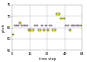
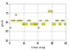
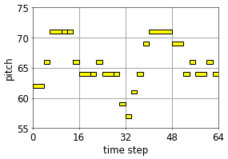
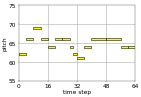
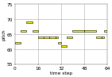
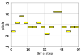

<link href="style.css" rel="stylesheet">

# Overview
- [Single attribute](#single-attribute)
- [Double attributes](#double-attributes)
- [Triple attribute](#triple-attributes)

# Single attribute

# Double attributes

## Total number of notes & pitch variability

|↓Less total number of notes↓|→More pitch variability→||
|:-:|:-:|:-:|
| <audio controls><source src="mp3/total_pitch/reels_simple_chords_418.mid_2_0.mp3"></audio>| <audio controls><source src="mp3/total_pitch/reels_simple_chords_418.mid_2_0_demo_Total_Number_of_Notes_1.3244_Pitch_Variability_-0.17049.mp3"></audio>| <audio controls><source src="mp3/total_pitch/reels_simple_chords_418.mid_2_0_demo_Total_Number_of_Notes_1.3244_Pitch_Variability_0.82951.mp3"></audio>|
| <audio controls><source src="mp3/total_pitch/reels_simple_chords_418.mid_2_0_demo_Total_Number_of_Notes_0.32442_Pitch_Variability_-1.1705.mp3"></audio>| <audio controls><source src="mp3/total_pitch/reels_simple_chords_418.mid_2_0_demo_Total_Number_of_Notes_0.32442_Pitch_Variability_-0.17049.mp3"></audio>| <audio controls><source src="mp3/total_pitch/reels_simple_chords_418.mid_2_0_demo_Total_Number_of_Notes_0.32442_Pitch_Variability_0.82951.mp3"></audio>|
| <audio controls><source src="mp3/total_pitch/reels_simple_chords_418.mid_2_0_demo_Total_Number_of_Notes_-0.67558_Pitch_Variability_-1.1705.mp3"></audio>| | <audio controls><source src="mp3/total_pitch/reels_simple_chords_418.mid_2_0_demo_Total_Number_of_Notes_-0.67558_Pitch_Variability_0.82951.mp3"></audio>|

# Triple attributes