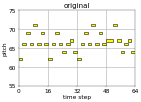
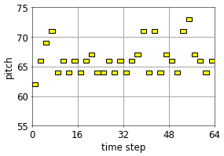
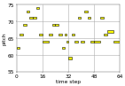

<link href="style.css" rel="stylesheet">

# Overview
- [Single attribute](#single-attribute)
- [Double attributes](#double-attributes)
- [Triple attribute](#triple-attributes)

# Single attribute

# Double attributes

### Total number of notes & pitch variability
|
  
|
  
|
  
|
|---|---|---|
|<audio controls><source src="mp3/total_pitch/reels_simple_chords_418.mid_2_0.mid.mp3"></audio>|<audio controls><source src="mp3/total_pitch/reels_simple_chords_418.mid_2_0_demo_Total_Number_of_Notes_1.3244_Pitch_Variability_-0.17049.mid.mp3"></audio>|<audio controls><source src="mp3/total_pitch/reels_simple_chords_418.mid_2_0_demo_Total_Number_of_Notes_1.3244_Pitch_Variability_0.82951.mid.mp3"></audio>|

# Triple attributes